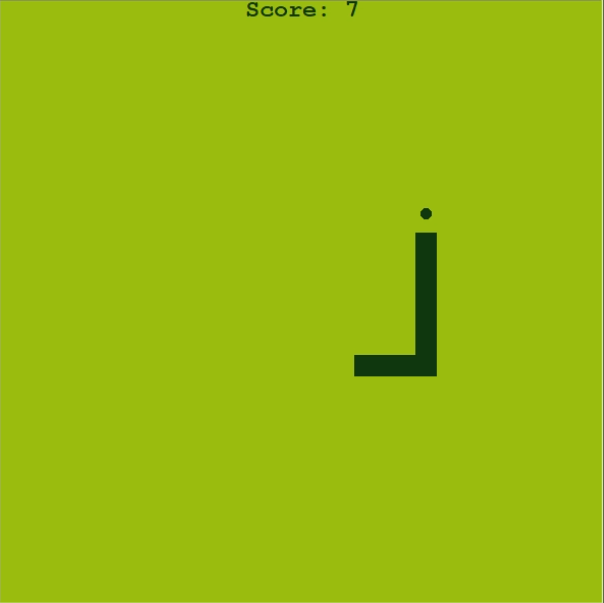

# 🐍 Snake Game (Python - Turtle)

This project is a Python-based recreation of the legendary Nokia 3310 Snake game,
A special appearance by the "Vishal Snake" and "Thala" segments inspired by memes

---

## 🎮 Gameplay

* Control the snake using arrow keys
* Eat the food to grow longer
* Each food increases your score
* Game ends if:

  * Snake hits the wall
  * Snake collides with itself

---

## 📸 Screenshot



---

## 📁 Project Structure

```
.
├── game.py
├── snake.py
├── food.py
├── scoreboard.py
├── high_score.txt
```

### Files Overview

* **game.py** → Main game loop and controls 
* **snake.py** → Snake movement and growth logic 
* **food.py** → Random food generation 
* **scoreboard.py** → Score + high score system 
* **high_score.txt** → Stores highest score locally 

---

## 🎯 Controls

| Key     | Action     |
| ------- | ---------- |
| ↑ Arrow | Move Up    |
| ↓ Arrow | Move Down  |
| ← Arrow | Move Left  |
| → Arrow | Move Right |

---

## 🚀 Features

* Smooth snake movement
* Food spawning at random positions
* Score + High Score system (saved locally)
* Collision detection (wall + self)
* Classic retro green theme

---

## 🧠 Concepts Used

* Object-Oriented Programming (OOP)
* Python Turtle Graphics
* Game loop & animation
* File handling (high score saving)
* Collision detection
